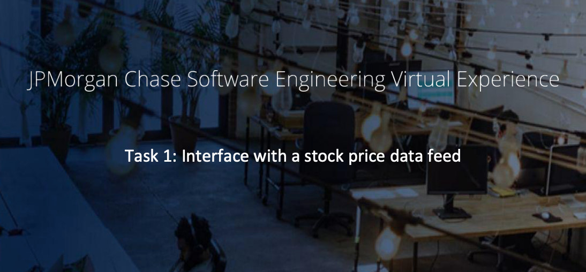
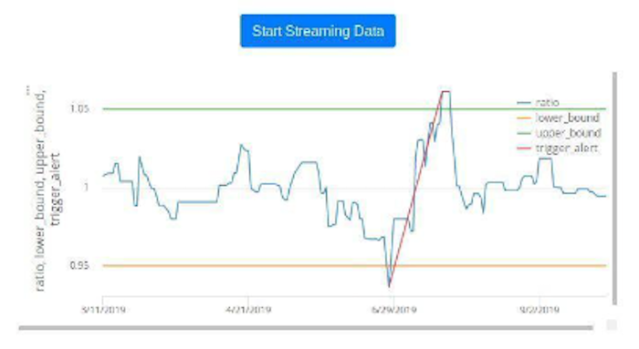

# JPMorgan Chase Software Engineering Program - Task 1

This task involves setting up a virtual pip3 'venv' environment for isolated dependencies, 
and updating the getRatio and getDataPoint methods in client3.py to compute the ratio of two stock prices.

<iframe width="700" height="343" src="https://www.youtube.com/embed/KTYlA0cbvDA" frameborder="0" allow="accelerometer; autoplay; clipboard-write; encrypted-media; gyroscope; picture-in-picture" allowfullscreen></iframe>

